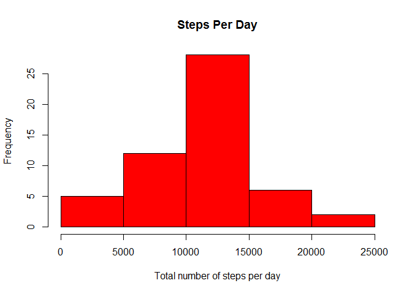
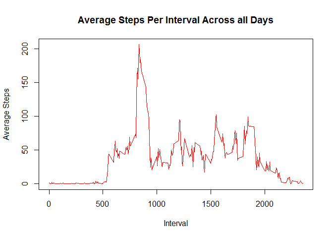
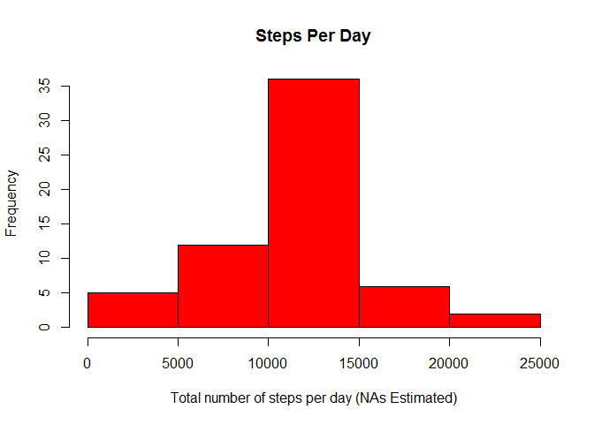
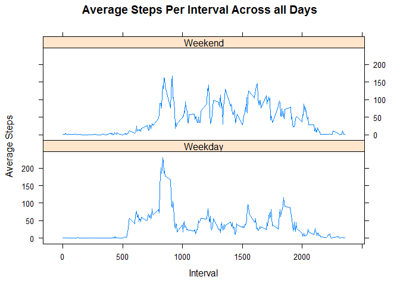

# Reproducible Research: Peer Assessment 1
## Introduction
It is now possible to collect a large amount of data about personal movement using activity monitoring devices such as a [Fitbit][1], [Nike Fuelband][2], or [Jawbone Up][3]. These type of devices are part of the "quantified self" movement - a group of enthusiasts who take measurements about themselves regularly to improve their health, to find patterns in their behavior, or because they are tech geeks. But these data remain under-utilized both because the raw data are hard to obtain and there is a lack of statistical methods and software for processing and interpreting the data.

[1]: http://www.fitbit.com/ "Fitbit"
[2]: http://www.nike.com/us/en_us/c/nikeplus-fuelband "Nike Fuelband" 
[3]: https://jawbone.com/up "Jawbone Up"

This assignment makes use of data from a personal activity monitoring device. This device collects data at 5 minute intervals through out the day. The data consists of two months of data from an anonymous individual collected during the months of October and November, 2012 and include the number of steps taken in 5 minute intervals each day.


## Data
The data for this assignment can be downloaded from the following link:

Dataset: [Activity monitoring data (52K)][4]
    
[4]: https://d396qusza40orc.cloudfront.net/repdata%2Fdata%2Factivity.zip "Activity monitoring data (52K)"

The variables included in this dataset are:

    - **steps**: Number of steps taking in a 5-minute interval (missing values are coded as NA)

    - **date**: The date on which the measurement was taken in YYYY-MM-DD format

    - **interval**: Identifier for the 5-minute interval in which measurement was taken

The dataset is stored in a comma-separated-value (CSV) file and there are a total of 17,568 observations in this dataset.


## Loading and preprocessing the data
It is assumed that the data for this assignment will be stored in a file named *activity.csv* contained within the same directory as the *.R* file performing the processing. The data is loaded into a variable *steps*. Structure of *steps* is examined as well as the first 10 rows:


```r
steps <- read.csv("activity.csv")
str(steps)
```

```
## 'data.frame':	17568 obs. of  3 variables:
##  $ steps   : int  NA NA NA NA NA NA NA NA NA NA ...
##  $ date    : Factor w/ 61 levels "2012-10-01","2012-10-02",..: 1 1 1 1 1 1 1 1 1 1 ...
##  $ interval: int  0 5 10 15 20 25 30 35 40 45 ...
```

```r
head(steps, n=10)
```

```
##    steps       date interval
## 1     NA 2012-10-01        0
## 2     NA 2012-10-01        5
## 3     NA 2012-10-01       10
## 4     NA 2012-10-01       15
## 5     NA 2012-10-01       20
## 6     NA 2012-10-01       25
## 7     NA 2012-10-01       30
## 8     NA 2012-10-01       35
## 9     NA 2012-10-01       40
## 10    NA 2012-10-01       45
```

It is observed that the date column is a factor. This column is converted to the Date class with the following code:


```r
steps$date <- as.Date(as.character(steps$date), format="%Y-%m-%d")
str(steps)
```

```
## 'data.frame':	17568 obs. of  3 variables:
##  $ steps   : int  NA NA NA NA NA NA NA NA NA NA ...
##  $ date    : Date, format: "2012-10-01" "2012-10-01" ...
##  $ interval: int  0 5 10 15 20 25 30 35 40 45 ...
```


## What is mean total number of steps taken per day?
For this portion of the assignment missing values can be ignored. A new dataset is created, which retains only complete observations of the *steps* data:


```r
steps_complete <- steps[complete.cases(steps), ]
str(steps_complete)
```

```
## 'data.frame':	15264 obs. of  3 variables:
##  $ steps   : int  0 0 0 0 0 0 0 0 0 0 ...
##  $ date    : Date, format: "2012-10-02" "2012-10-02" ...
##  $ interval: int  0 5 10 15 20 25 30 35 40 45 ...
```

Next we calculate the total number of steps per day. To accomplish this we will use the *plyr* library. If you do not have the *plyr* library installed in R you can install it using the following command *install.packages("plyr")*:

Then load the library and perform the calculations saving the result in a new variable *steps_perday*


```r
library(plyr)
steps_perday <- ddply(steps_complete, .(date), summarize, total_steps=sum(steps))
steps_perday
```

```
##          date total_steps
## 1  2012-10-02         126
## 2  2012-10-03       11352
## 3  2012-10-04       12116
## 4  2012-10-05       13294
## 5  2012-10-06       15420
## 6  2012-10-07       11015
## 7  2012-10-09       12811
## 8  2012-10-10        9900
## 9  2012-10-11       10304
## 10 2012-10-12       17382
## 11 2012-10-13       12426
## 12 2012-10-14       15098
## 13 2012-10-15       10139
## 14 2012-10-16       15084
## 15 2012-10-17       13452
## 16 2012-10-18       10056
## 17 2012-10-19       11829
## 18 2012-10-20       10395
## 19 2012-10-21        8821
## 20 2012-10-22       13460
## 21 2012-10-23        8918
## 22 2012-10-24        8355
## 23 2012-10-25        2492
## 24 2012-10-26        6778
## 25 2012-10-27       10119
## 26 2012-10-28       11458
## 27 2012-10-29        5018
## 28 2012-10-30        9819
## 29 2012-10-31       15414
## 30 2012-11-02       10600
## 31 2012-11-03       10571
## 32 2012-11-05       10439
## 33 2012-11-06        8334
## 34 2012-11-07       12883
## 35 2012-11-08        3219
## 36 2012-11-11       12608
## 37 2012-11-12       10765
## 38 2012-11-13        7336
## 39 2012-11-15          41
## 40 2012-11-16        5441
## 41 2012-11-17       14339
## 42 2012-11-18       15110
## 43 2012-11-19        8841
## 44 2012-11-20        4472
## 45 2012-11-21       12787
## 46 2012-11-22       20427
## 47 2012-11-23       21194
## 48 2012-11-24       14478
## 49 2012-11-25       11834
## 50 2012-11-26       11162
## 51 2012-11-27       13646
## 52 2012-11-28       10183
## 53 2012-11-29        7047
```

Next make a histogram of the total number of steps per day:


```r
hist(steps_perday$total_steps, col="red", xlab="Total number of steps per day", ylab="Frequency", main="Steps Per Day")
```

 

The mean and median of the total number of steps per day are calculated:


```r
mean(steps_perday$total_steps)
```

```
## [1] 10766.19
```

```r
median(steps_perday$total_steps)
```

```
## [1] 10765
```

The mean number of steps per day is 10766.19 and the median is 10765

## What is the average daily activity pattern?
Using the plyr package and ddply function as in the previous step, we will arrange our dataset to get the average number of steps per interval, across all days. Again we will use our only complete observations in this analysis.


```r
steps_perinterval <- ddply(steps_complete, .(interval), summarize, average_steps=mean(steps))
head(steps_perinterval, n=10)
```

```
##    interval average_steps
## 1         0     1.7169811
## 2         5     0.3396226
## 3        10     0.1320755
## 4        15     0.1509434
## 5        20     0.0754717
## 6        25     2.0943396
## 7        30     0.5283019
## 8        35     0.8679245
## 9        40     0.0000000
## 10       45     1.4716981
```

We now make a time series plot of the 5-minute interval (x-axis) and the average number of steps taken, averaged across all days (y-axis)


```r
plot(steps_perinterval$interval, steps_perinterval$average_steps, type="l", col="red", xlab="Interval", ylab="Average Steps", main="Average Steps Per Interval Across all Days")
```

 

Determining which 5-minute interval, on average across all the days in the dataset, contains the maximum number of steps:


```r
steps_perinterval[steps_perinterval$average_steps == max(steps_perinterval$average_steps), ]
```

```
##     interval average_steps
## 104      835      206.1698
```

Interval 835 contains the maximum number of steps averaged across all days.

## Imputing missing values

There are a number of days/intervals in the original data where there are missing values (coded as NA). The presence of missing days may introduce bias into some calculations or summaries of the data.

The following code determines the total number of missing values in the dataset (i.e. the total number of rows with NAs)


```r
sum(is.na(steps$steps))
```

```
## [1] 2304
```

There are 2304 rows with missing values in the dataset.


Missing values in the dataset will be filled in using the mean for that 5-minute interval as calculated in the previous section on average daily activity pattern.

We will now create a new dataset that is equal to the original dataset but with the missing data filled in. To accomplish this, we will extract all rows with NA values into a separate dataset. This dataset is merged with the steps_perinterval dataset on the interval variable. In the event that sorting occurs on the merged dataset re-sort dataset by date and then interval.


```r
steps_na <- steps[is.na(steps$steps), ]
steps_merged <- arrange((merge(steps_na, steps_perinterval, by="interval", sort=FALSE)), date, interval)
head(steps_merged)
```

```
##   interval steps       date average_steps
## 1        0    NA 2012-10-01     1.7169811
## 2        5    NA 2012-10-01     0.3396226
## 3       10    NA 2012-10-01     0.1320755
## 4       15    NA 2012-10-01     0.1509434
## 5       20    NA 2012-10-01     0.0754717
## 6       25    NA 2012-10-01     2.0943396
```

Perform an rbind on the *steps_complete* and the relevant subset of the *steps_merged* dataset, then arrange by date then interval.


```r
#rename average_steps columns to steps for rbind operation
names(steps_merged)[c(2, 4)] <- c("steps_old", "steps")
steps <- arrange(rbind(steps_complete, steps_merged[,c(4,3, 1)]), date, interval)
head(steps)
```

```
##       steps       date interval
## 1 1.7169811 2012-10-01        0
## 2 0.3396226 2012-10-01        5
## 3 0.1320755 2012-10-01       10
## 4 0.1509434 2012-10-01       15
## 5 0.0754717 2012-10-01       20
## 6 2.0943396 2012-10-01       25
```

```r
#recount the number of missing values - this should now be 0
sum(is.na(steps$steps))
```

```
## [1] 0
```

Reprocess the number of steps taken each day along with mean and median


```r
steps_perday2 <- ddply(steps, .(date), summarize, total_steps=sum(steps))
steps_perday2
```

```
##          date total_steps
## 1  2012-10-01    10766.19
## 2  2012-10-02      126.00
## 3  2012-10-03    11352.00
## 4  2012-10-04    12116.00
## 5  2012-10-05    13294.00
## 6  2012-10-06    15420.00
## 7  2012-10-07    11015.00
## 8  2012-10-08    10766.19
## 9  2012-10-09    12811.00
## 10 2012-10-10     9900.00
## 11 2012-10-11    10304.00
## 12 2012-10-12    17382.00
## 13 2012-10-13    12426.00
## 14 2012-10-14    15098.00
## 15 2012-10-15    10139.00
## 16 2012-10-16    15084.00
## 17 2012-10-17    13452.00
## 18 2012-10-18    10056.00
## 19 2012-10-19    11829.00
## 20 2012-10-20    10395.00
## 21 2012-10-21     8821.00
## 22 2012-10-22    13460.00
## 23 2012-10-23     8918.00
## 24 2012-10-24     8355.00
## 25 2012-10-25     2492.00
## 26 2012-10-26     6778.00
## 27 2012-10-27    10119.00
## 28 2012-10-28    11458.00
## 29 2012-10-29     5018.00
## 30 2012-10-30     9819.00
## 31 2012-10-31    15414.00
## 32 2012-11-01    10766.19
## 33 2012-11-02    10600.00
## 34 2012-11-03    10571.00
## 35 2012-11-04    10766.19
## 36 2012-11-05    10439.00
## 37 2012-11-06     8334.00
## 38 2012-11-07    12883.00
## 39 2012-11-08     3219.00
## 40 2012-11-09    10766.19
## 41 2012-11-10    10766.19
## 42 2012-11-11    12608.00
## 43 2012-11-12    10765.00
## 44 2012-11-13     7336.00
## 45 2012-11-14    10766.19
## 46 2012-11-15       41.00
## 47 2012-11-16     5441.00
## 48 2012-11-17    14339.00
## 49 2012-11-18    15110.00
## 50 2012-11-19     8841.00
## 51 2012-11-20     4472.00
## 52 2012-11-21    12787.00
## 53 2012-11-22    20427.00
## 54 2012-11-23    21194.00
## 55 2012-11-24    14478.00
## 56 2012-11-25    11834.00
## 57 2012-11-26    11162.00
## 58 2012-11-27    13646.00
## 59 2012-11-28    10183.00
## 60 2012-11-29     7047.00
## 61 2012-11-30    10766.19
```

The following plot shows a histogram of the total number of steps taken each day


```r
hist(steps_perday2$total_steps, col="red", xlab="Total number of steps per day (NAs Estimated)", ylab="Frequency", main="Steps Per Day")
```

 

The mean and median of the total number of steps per day with NA values estimated are calculated as follows:


```r
mean(steps_perday2$total_steps)
```

```
## [1] 10766.19
```

```r
median(steps_perday2$total_steps)
```

```
## [1] 10766.19
```

The mean number of steps per day, having estimated and filled in NAs is 10766.19 and the median is 10766.19. These values do not differ much from the estimates from the first part of the assignment. The mean was consistent with the previously calculated value while the median was slightly higher than the previously calculated values. Imputing missing data on the estimates of the total daily number of steps resulted in causing both mean and median to be equal to the same value.


## Are there differences in activity patterns between weekdays and weekends?
Create a new factor variable in the dataset with two levels - "weekday" and "weekend" indicating whether a given date is a weekday or weekend day.

To do this we use the mutate function to add a new column to the steps dataset. If the day of *date* is "Saturday" or "Sunday" this column is given the values "Weekend", and "Weekday" otherwise. The column is then converted to a factor variable.


```r
steps <- mutate(steps, time_of_week = ifelse(weekdays(date)=="Saturday"|weekdays(date)=="Sunday", "Weekend", "Weekday"))
steps$time_of_week <- as.factor(as.character(steps$time_of_week))
```

The following creates a time series panel plot comparison of the 5-minute interval (x-axis) and the average number of steps taken, averaged across all days for weekday and weekends.

We will utilize the *lattice* plotting library for this.


```r
library(lattice)
weeksteps_perinterval <- ddply(steps, .(time_of_week, interval), summarize, average_steps=mean(steps))
xyplot(average_steps ~ interval | time_of_week, data=weeksteps_perinterval, layout=c(1,2), type='l', xlab="Interval", ylab="Average Steps", main="Average Steps Per Interval Across all Days")
```

 

